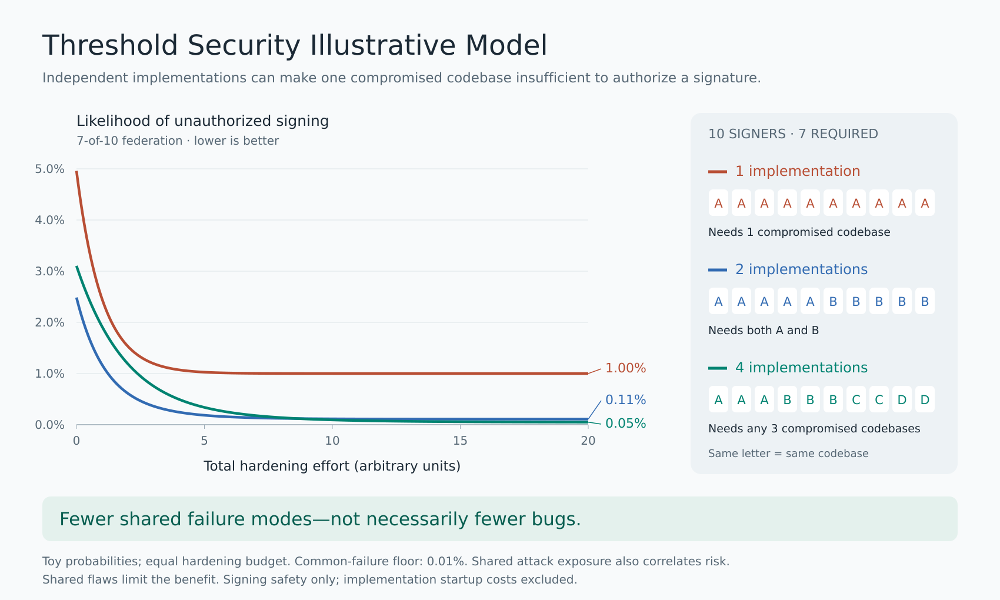
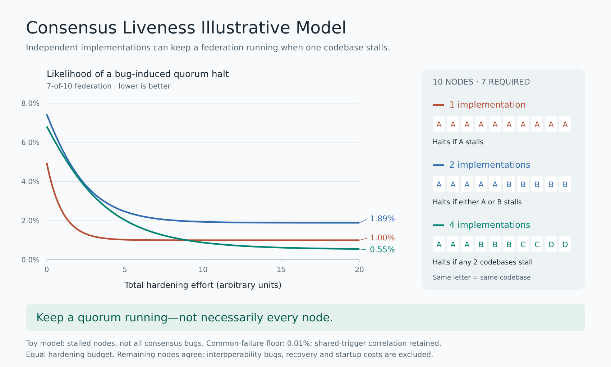
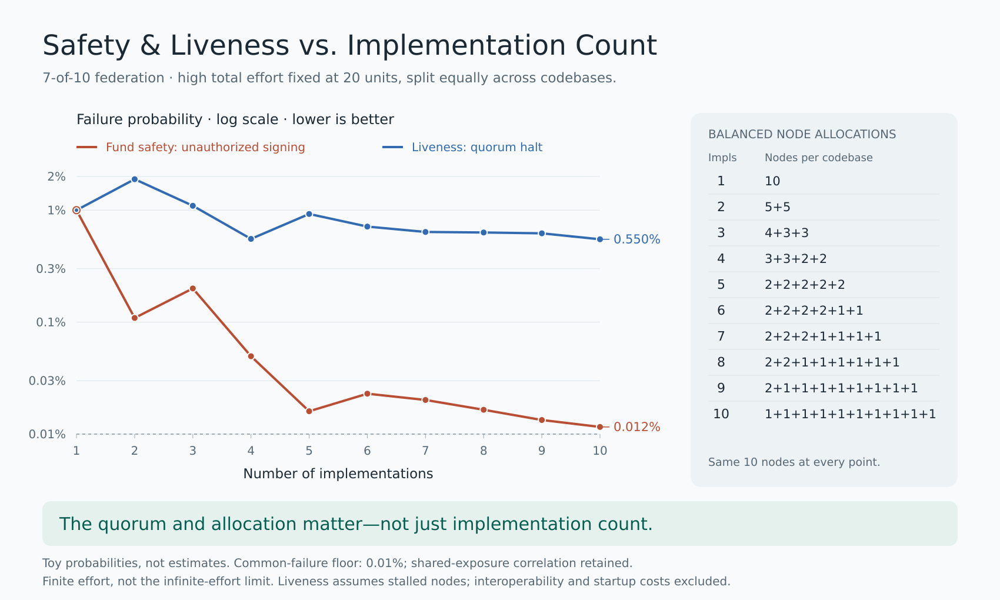

# Threshold Illustrations

Illustrative models of how implementation diversity affects **signing safety** and **consensus liveness** in a **7-of-10 federation**, comparing hardening effort for one, two, and four codebases, plus a fixed-high-effort comparison across one to ten codebases.

**These are hypothetical probabilities, not security or reliability estimates for Fedimint or any deployed system.**

## Signing safety



| Implementations | Signer allocation | Codebase compromises needed for unauthorized signing |
| --- | --- | --- |
| 1 | 10 | One |
| 2 | 5 + 5 | Both |
| 4 | 3 + 3 + 2 + 2 | Any three |

[SVG](threshold-diversity.svg) · [Data](threshold-diversity.csv) · [Model and limitations](threshold-diversity-model.md) · [Generator](threshold_diversity.py)

## Consensus liveness



The liveness model assumes bugs stall nodes or make them refuse to vote. Four unavailable nodes prevent a seven-node quorum; remaining nodes are assumed compatible and able to communicate.

| Implementations | Node allocation | Codebase stalls needed to halt the federation |
| --- | --- | --- |
| 1 | 10 | One |
| 2 | 5 + 5 | Either one |
| 4 | 3 + 3 + 2 + 2 | Any two |

[SVG](consensus-liveness.svg) · [Data](consensus-liveness.csv) · [Model and limitations](consensus-liveness-model.md) · [Generator](consensus_liveness.py)

## Implementation count at high effort



A fixed **20-unit total hardening budget** is divided across **1–10 implementations**, with ten nodes allocated as evenly as possible. Both curves show failure probabilities; lower is better. The vertical axis is logarithmic. This uses the existing charts' high-effort endpoint, not infinite effort.

[SVG](implementation-count.svg) · [Data](implementation-count.csv) · [Model and limitations](implementation-count-model.md) · [Generator](implementation_count.py)

## Shared assumptions

- Total hardening effort is divided equally across codebases, with diminishing returns.
- Each model's single-implementation risk approaches **1%**.
- A **0.01% common-failure event** directly causes system failure.
- A separate **9.9% shared-exposure scenario** creates additional correlation. Conditional on that scenario, codebase failures are independent, with probability `p(e) = 0.10 + 0.40 * exp(-e)`.
- Overall risk is `0.0001 + 0.099 * Q`, where `Q` is the relevant conditional threshold-failure probability.
- Thus these are **not** models of unconditionally independent 1% implementation failures.
- Implementation startup costs, unequal codebase quality and interoperability regressions are excluded. The liveness chart models quorum loss, not every consensus bug or outage duration.

The identical parameters make the two mechanisms easier to compare; they do not imply that real safety and liveness bug rates are equal. See the model notes for formulas and limitations.

## Regenerate

Requirements: Python 3 (standard library only) and ImageMagick with SVG rendering support for PNG output.

```sh
python3 threshold_diversity.py
python3 consensus_liveness.py
python3 implementation_count.py

magick -background '#f8fafb' threshold-diversity.svg threshold-diversity.png
magick -background '#f8fafb' consensus-liveness.svg consensus-liveness.png
magick -background '#f8fafb' implementation-count.svg implementation-count.png
```

Each Python script checks exhaustive failure-state enumeration against closed-form probabilities or an independent convolution, validates model invariants, and writes its SVG and CSV alongside itself. The implementation-count generator also checks agreement with the companion CSVs at total effort E=20. PNG appearance can vary with renderer and installed fonts; the SVG requests DejaVu Sans.
